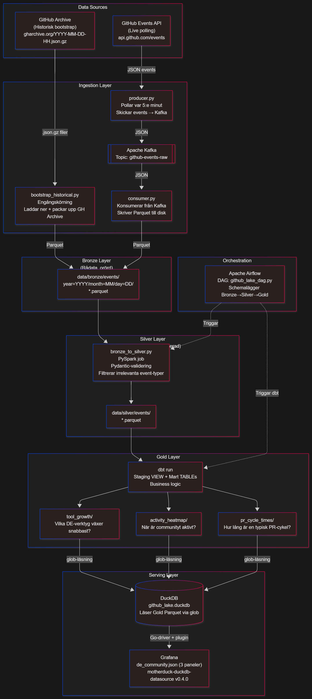

# GitHub Data Lake - Medallion Architecture
 
> A data engineering portfolio project - streaming Github Events into a Bronze -> Silver -> Gold pipeline, orchestrated by Airflow, transformed with PySpark + dbt, and served via Grafana + DuckDB.
 

 
---

## What This Project Does
 
The Data Engineering community on GitHub generates thousands of events every day. This pipeline captures that stream, filters it for DE-relevant repositories, and transforms raw event noise into three analytical Gold tables:
 
| Gold Table | Business Question |
|---|---|
| `tool_growth` | Which DE tools (dbt, Airflow, Spark, DuckDB...) are gaining the most stars per week? |
| `activity_heatmap` | When is the DE community most active across the globe - hour by hour, day by day? |
| `pr_cycle_times` | What is the typical PR cycle time (median + p95) across top DE repositories? |
 
**Current dataset:** ~2.1M Silver records covering August 2025 -> June 2026.
 
---

## Architecture
 
The pipeline follows the **Medallion architecture** (Bronze -> Silver -> Gold):
 
- **Bronze** - Raw, immutable GitHub Events stored as Hive-partitioned Parquet (`year=/month=/day=/`)

- **Silver** - Validated, deduplicated, and flattened records (PySpark). Filtered to DE-relevant repositories via `DE_KEYWORDS`

- **Gold** - Aggregated analytical tables produced by dbt models

- **Orchestration** - Apache Airflow DAG (`github_lake_dag.py`) schedules the full Bronze -> Silver -> Gold pipeline

- **Serving** - Grafana reads Gold Parquet files via DuckDB (`motherduck-duckdb-datasource` plugin)

See [`docs/architecture/`](docs/architecture/) for detailed Mermaid diagrams per layer.
 
---

## Tech Stack
 
| Category | Technology |
|---|---|
| Language | Python 3.12, managed via `uv` |
| Ingestion | Apache Kafka (KRaft - no ZooKeeper), GitHub REST API |
| Processing | Apache Spark 3.5.3 (PySpark) |
| Transformation | dbt-core + dbt-duckdb |
| Query Engine | DuckDB |
| Orchestration | Apache Airflow (LocalExecutor + PostgreSQL metadata DB) |
| Serving | Grafana + motherduck-duckdb-datasource v0.4.0 |
| Storage | Local Parquet (Hive-partitioned) |
| Infrastructure | Docker Compose, custom Spark + dbt Dockerfiles |
| CI / Quality | GitHub Actions, Ruff, Black, Pytest (12 unit tests) |
 
---

## Project Structure
 
```text
github-data-lake/
├── .github/workflows/ci.yml               # GitHub Actions: lint + format + pytest
├── ingestion/
│   ├── producer.py                        # GitHub API -> Kafka topic (polls every 5 min)
│   └── consumer.py                        # Kafka -> Bronze (Hive-partitioned Parquet)
│
├── transforms/
│   ├── bronze_to_silver.py                # PySpark: raw -> validated + deduplicated
│   └── silver_to_gold.py                  # PySpark CLI alternative (dbt is primary in v3+)
│
├── dbt/
│   └── models/
│       ├── staging/stg_github_events.sql  # VIEW - live window over Silver Parquet
│       └── marts/                         # tool_growth · activity_heatmap · pr_cycle_times
│
├── orchestration/dags/github_lake_dag.py  # Airflow DAG: Bronze -> Silver -Z Gold
│
├── serving/grafana/
│   ├── dashboards/de_community.json       # Grafana dashboard (3 panels)
│   ├── plugins/                           # Gitignored - manual install required (see below)
│   └── provisioning/                      # datasources/duckdb.yml + dashboards/provider.yml
│
├── scripts/
│   ├── bootstrap_historical.py            # GitHub Archive -> Bronze (one-off historical load)
│   └── run_pipeline.py                    # argparse CLI: --layer bronze|silver|gold|all
│
├── tests/test_transforms.py               # 12 PySpark unit tests (transformations + checkpoints)
├── docs/architecture/                     # Mermaid diagrams: overview · ingestion · transforms · serving
├── docker-compose.yml
├── Dockerfile.spark                       # Custom Spark image with project Python dependencies
├── Dockerfile.dbt                         # dbt container for Airflow DockerOperator
├── config.py                              # Central config: paths, Kafka topics, DE_KEYWORDS
└── pyproject.toml                         # uv dependency management
```
 
---

## Running Locally
 
### Prerequisites
 
- Docker Desktop (WSL2 backend on Windows)
- Python 3.12 + [`uv`](https://github.com/astral-sh/uv)
- GitHub personal access token (classic, `public_repo` scope)

### Setup
 
```bash
git clone https://github.com/<your-username>/github-data-lake.git
cd github-data-lake
cp .env.example .env
uv sync
```
 
Open `.env` and fill in two required values:
 
```env
GITHUB_TOKEN=your_token_here
PROJECT_ROOT=/absolute/path/to/github-data-lake
```
 
`PROJECT_ROOT` must be the **absolute host path** to the project root. Airflows `DockerOperator` resolves volume mount paths relative to the host machine, not relative to the Airflow container.
 
### Install the Grafana plugin (required before first start)
 
See [Grafana Plugin - Manual Installation](#grafana-plugin--manual-installation-required) below.
 
### Start the full stack
 
```bash
docker compose up -d
```
 
This starts: Kafka (KRaft), Airflow (webserver + scheduler + PostgreSQL), Spark, dbt, and Grafana.
 
| Service | URL | Credentials |
|---|---|---|
| Airflow | http://localhost:8080 | username / password |
| Grafana | http://localhost:3000 | username / password |
 
### Load historical data (recommended)
 
The live producer polls every 2 minutes - volume is low for meaningful analysis. Bootstrap from Github Archive to get a substantial dataset:
 
```bash
docker compose run --rm spark python scripts/bootstrap_historical.py \
  --start 2025-11-01 --end 2026-04-30
```
 
### Run the pipeline
 
Trigger the Airflow DAG manually at http://localhost:8080, or let it run on its configured schedule.
 
Pipeline sequence: `ingest (Kafka producer/consumer)` -> `bronze_to_silver (PySpark)` -> `silver_to_gold (dbt)`
 
---
 
## Grafana Plugin, Manual Installation Required
 
The `motherduck-duckdb-datasource` plugin is not in Grafana's official registry and is excluded from this repository (binary file). Install it once before starting Grafana:
 
```bash
curl -LO https://github.com/motherduckdb/grafana-duckdb-datasource/releases/download/v0.4.0/motherduck-duckdb-datasource-0.4.0.zip
mkdir -p serving/grafana/plugins
unzip motherduck-duckdb-datasource-0.4.0.zip -d serving/grafana/plugins/motherduck-duckdb-datasource
```
 
Verify the extraction - `plugin.json` must be directly inside `motherduck-duckdb-datasource/`, not nested one level deeper:
 
```bash
ls serving/grafana/plugins/motherduck-duckdb-datasource/
# Expected: plugin.json  ...binaries...
```
 
Then start Grafana normally:
 
```bash
docker compose up -d grafana
```
 
---
 
## Serving Layer Recovery
 
If `serving/grafana/plugins/` is deleted (for example, by accidentally running `git clean -fdx` - the `-x` flag removes gitignored files), re-run the plugin installation above and restart Grafana:
 
```bash
docker compose restart grafana
```
 
The dashboard (`de_community.json`) and datasource config (`duckdb.yml`) are committed to the repository and will be re-provisioned automatically on restart.
 
> `git clean -fd` is safe for general cleanup. `git clean -fdx` removes gitignored files - use it only when you explicitly intend to wipe local-only artifacts like `.env` and plugin binaries.
 
---
 
## Project Status
 
| Tag | Description |
|---|---|
| `v1.0` | Bronze -> Silver pipeline, Kafka + local Parquet, CI |
| `v2.0` | PySpark migration, Gold layer, historical bootstrap |
| `v3.0.0` | Airflow orchestration, dbt Gold models, Grafana serving |
| `v3.0.1` | Checkpoint fix, PySpark unit tests restored (12/12 green) |
| `v3.0.2` | Serving layer rebuilt, Grafana dashboard verified |

 
**Current:** `v3.0.2` - Cleanup sprint complete.  
**Next:** MVP v4 - data quality contracts (Soda Core as Silver -> Gold gatekeeper in Airflow).

 
--> [Full Roadmap](ROADMAP.md)
 
---
 
## Architecture Decisions
 
Non-obvious decisions are documented with full rationale in [`Documents`](docs/file_docs/). Highlights:
 
- Why `payload` is serialized as a JSON string in Bronze (PyArrow schema inference collapses inconsistent nested structs silently)
- Why `get_json_object` over UDFs in PySpark (JVM serialization overhead)
- Why `pr_action = 'merged'` and not `pr_merged = true` to identify merged PRs (GitHub API quirk found via raw data debugging)
- Why the Grafana image must be `grafana:latest-ubuntu`, not the default Alpine (duckdb-go requires glibc; musl/Alpine is a silent fail)
- Why `CAST(SUM(x) AS BIGINT)` is required in all Grafana queries (`SUM(BIGINT)` returns `HUGEINT` in DuckDB; Grafana's Go driver can't handle 128-bit integers)

