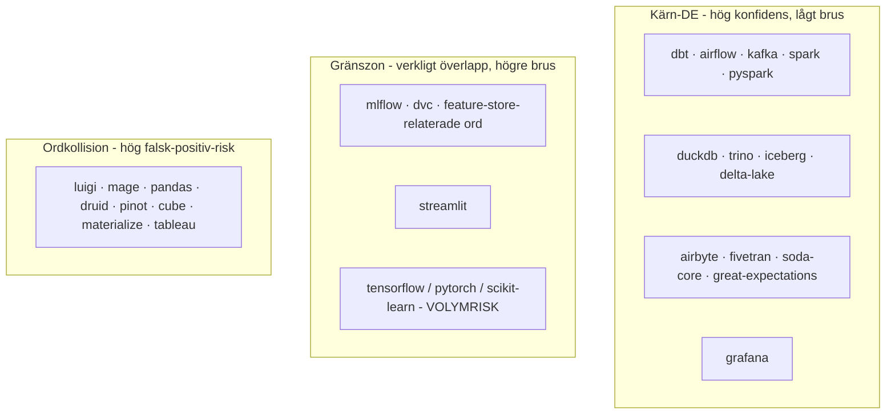

# Docs regarding how to expand my DE_KEYWORDS search in config.py script
*Written 2026-06-24*
- To implement a new list of keywords to search for I need to evaluate the more risky keywords as to not get too overwhelmed and refactor too much before knowing it will work both upstream and downstream. I should be precise and know the 'risks' some of my initial plans for new keywords to implement brings. Risky keywords such as:

**Specific words I should flag as "high risk"** (Common english words/names):

| Word | Intended meaning | Collision risk |
|---|---|---|
| `luigi` | Spotify workflow tool | Mario character. Massive gaming/fan repo noise. |
| `mage` | Mage AI | General English fantasy word "wizard". Gaming/D&D noise. |
| `pandas` | Python library | Animal. Zoo/wildlife repos. |
| `druid` | Apache Druid | D&D/fantasy class. Gaming noise. |
| `pinot` | Apache Pinot | Grape variety (Pinot Noir/Grigio). Wine app noise. |
| `materialize` | Streaming database | Completely common English VERB "to materialize". **Huge** range of hits. |
| `cube` | Cube (semantic layer) | Extremely generic geometric/gaming word. |
| `tableau` | BI tool | French word "table/table". Art/French language repos. |

---
## More complex than previously thought

This is not just the feeling that this will be harder than expected, it *is* and *will* be, and its worth understanding why. This is "similar" to the issue I stumbled upon with `is_bot` categorization but `is_bot` had **one** risk axis: name patterns that accidentally catch a human (the `flinkbot` type, already solved with precision over recall). The `DE_KEYWORDS` list has **three separate risk axes** at once, and they require different solutions:

1. **Word collision**: the word means something completely different in plain English (`luigi`, `mage`, `pandas` as animals, `druid`, `pinot`, `cube`, `materialize` as verbs, `tableau` as a French word) This is the same type of problem as `is_bot`'s `bot-`/`bot_` prefix issue that was solved by removing the word or requiring extra context.

2. **Scope Crawling**: the hit is *technically correct* and it is indeed an MLOps tool, but it gradually shifts what "DE community" means. `is_bot` never had this issue, there "bot or human" was a stable definition. Here, the very *definition* of what I am measure is shifting with time.

3. **Volume dominance**: the hit is correct AND on topic, but so hugely popular globally that it drowns out everything else numerically. This is completely new and, I think, the most important risk for `tensorflow`/`pytorch`/`scikit-learn` in particular.

## From my specific examples:

| Tools | Risk axis that dominates | Assessment |
|---|---|---|
| `pyspark` | None, already core | **Keep.** Already in the original list, is the Spark ecosystem. |
| `tensorflow` / `pytorch` / `scikit-learn` | **Volume dominance**, highest risk | See below, this is not a "wrong/right" word, this is a pure volume question. |
| `grafana` | None | **Keep, high confidence.** Already a confirmed part of my own serving layer, low collision word. |
| `streamlit` | Scope creep, low | **Keep, border zone.** No collision word, but more DS presentation than DE pipeline building. |

**Why volume dominance is the real risk for tensorflow/pytorch/scikit-learn**: Its not precision, the matching repos are not "wrong" per se but a student training a CNN *is* a technically a tensorflow repo, perfectly properly tagged. The problem is *scale*. Github likely has *tens of thousands* of `tensorflow/pytorch` tutorial, Kaggle, and course repos for every genuine "feature store" or "ML pipeline" repo that actually crosses into `data engineering` territory.

If I were to include those words, the **center of gravity** of the dataset could shift from `DE community` to `global ML hobbyist activity with a little DE involved`. Without a single match being technically incorrect. This is directly testable with my stand-alone script for a 24h validation idea which will compare how many repos `dbt` hits against how many `tensorflow` hits during the same 24-hour window. I suspect an **order of magnitude difference**.

## Mental model for sorting, three levels, not a flat list

This is **just an analysis** for sorting my list, it doesnt change the ingestion architecture itself, which is still a simple binary gate (match ANY keyword --> in). Im not building a weighted filter now, that would have been over engineering for MVP v5. The levels just helps me discuss *which* words belong in the simple list.