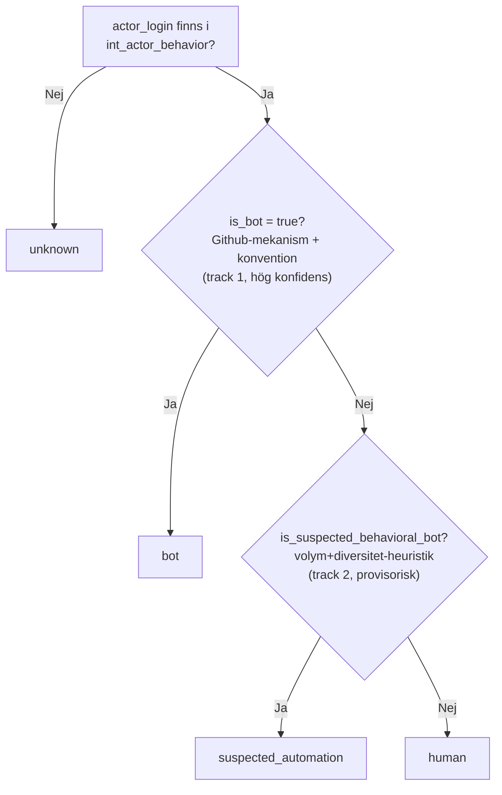

# Docs regarding bot classifying
How should i classify that a bot is a bot vs human in my data from github.
Githubs normal naming convention always places `bot` "markers" in the end of the login name and never in the start or in the middle of the name, example: `dependabot[bot]`. A normal user cant even register a name with '[ ]' in its username. Therefore I should classify bots with `[bot]`. BUT it isnt that simple. I should ALSO look into behaviours for an actor.. For example:

| actor_login | event_count | unique_event_types | unique_repos |
|:---|:---|:---|:---|
| gemabintang3108-prog|	63706|	1|	1|
| potiuk | 6357 | 5 | 132 |
| Mytherin | 3285 | 5 | 51 | 

- This example above is almost clearly a bot account, reason for this is its *one* actor, thousands of events to *ONE* repo. BUT even this is not 100% certain since users like `potiuk` is a human that works with open source projects and is an open source maintainer. Same with the user `Mytherin`, that person is `Mark Raasveldt` the founder of `DuckDB`.

---

- Name prefix using:
    - _bot
    - -bot
    - bot
    - [bot]


## Step 1 for this `is_bot`-flag should be:
- First steps I should take is use what I have already built and expand on it once it is working. Therefore I should start with just a pure function, to know if a single row should be flagged i only need to watch that one rows `actor_login`. No context from other rows are needed, that is the exact form a `withColumn()`-expression in my `_transform()`-function already has. 

- The *second* step I should take is probably do an `aggregation`. To know if `gemabintang3108-prog` is suspicious i *MUST* first count *ALL* events, *ALL* unique `event_types`, *ALL* unique `repos` compared to all other actors. That cannot be a column in my `_transform()`-function because `_transform()` works row by row(or batch by batch). It never has the entire datasets history in its scope at the same time. That would need a separate step, some kind of `GROUP BY actor_login`-aggregation, either something like a middle table like "actor reputation" or purely a gold model/mart in of itself.

----

## Big differences in identifying bots vs humans.

This is a question between deterministic logic(That which I know with 100% cetrainty) that belongs in silver vs *Behavior-based logic* (that which I infer through aggregation that belongs in gold/dbt).

1) - In `Silver` (*Upstream*): Here i will place `is_bot = True` based on strict, un-changeable rules(names)
2) - In `Gold` (*Downstream*): Here I will need to look after accounts that *claim* to be human. For example: `gemabintang3108-prog` which does 60k commits within a day to *one* repo.

---

* **BUT** Having decided where my bot classification belongs in the pipeline I am now infront of a `data quality`-trap. Should I decide to use a simple `LIKE '%bot%'` or `.contains("bot")` I will for sure butcher legitimate and real users and give myself a lot of headache with `False Positives` and that will *destroy* my gold data as much as it will *if* I miss a `bot` (probably more to be honest). What I **COULD** do is something like this:

```python
from pyspark.sql.functions import col, when, lower

# I min bronze_to_silver _transform() funktion

df = df.withColumn(
    "is_bot",
    when(
        # 1. De officiella Github-apparna som alltid slutar på [bot]
        col("actor_login").endswith("[bot]") |
        
        # 2. De som explicit slutar på -bot eller _bot (fångar INTE users med t.ex "abbot")
        col("actor_login").endswith("-bot") |
        col("actor_login").endswith("_bot") |
        
        # 3. Kända mass automationsverktyg (exact match eller starts with)
        lower(col("actor_login")).startswith("dependabot") |
        lower(col("actor_login")).startswith("renovate") |
        lower(col("actor_login")).startswith("github-actions") |
        lower(col("actor_login")).startswith("snyk"),
        True
    ).otherwise(False)
)
```

- What this logic *could* work and solve for me is:
    - *No false positives*: By using `.endswith("-bot")` I make it impossible for users like "abbot" or "talbot" etc to be flagged as a `bot`

    - *Case insensitive*: By standardising everything with `lower()` I protect myself against users that might be named `Dependabot` instead of expected `dependabot`.

    - *Performance*: `PySpark` evaluates this super fast on row level without having to do any heavy joins or aggregations.


---

## Testing
* Before I implement this filter for bots I should also write tests to evaluate my logic with a mocked list of names, with a few names like `["abbot", "my-bot", "Johnny", "DePenDaBOT", "Lovable[bot], ..., ....]` **BEFORE** I run the entire pipeline.

* Running isolated `test_bot_classification.py` script:
    * ` uv run pytest tests/test_bot_classification.py -v `


---

## Bots on Github

**`[bot]`-suffixet är Githubs egen mekanism för att identifiera bots**, inte en "guideline". När någon registrerar en Github App lägger Github *automatiskt* till `[bot]` på dess identitet. Det är så nära en officiell sanning Jag kan komma utan att fråga Githubs API direkt.

**`-bot`/`_bot`-suffixet och `dependabot`/`renovate`/`github-actions`-prefixen är däremot en community "konvention"**, inte en Github regel. Jag känner redan igen de namnen för att de är väletablerade, kända automationsverktyg, men att matcha på prefix/suffix är *min* heuristik baserad på igenkänning, inte något Github garanterar eller kräver av någon.

Den distinktionen spelar roll. T.ex om någon frågar: "är det här en av Githubs regler eller är det ditt eget antagande?"  Här är svaret istället för att jag ska klumpa ihop allt under "per Githubs guidelines"

---
* **Hur identifieras en bot då?**



Via flowcharten ovanför så kan vem som tittar på Gold datan nästan se direkt vilka rader som tyder på en stark signal och vilka som vilar på en gissning som väntar på mer data.

## Skärpning av mina tankar kring: "behöver ML och TB av data"-resonemanget jag hade innan för att på riktigt identifiera bots och "misstänkt" beteende.

Instinkten jag hade var rätt, men för att vara mer precis om just *varför*, det gör argumentet.

Det centrala hindret är inte primärt datavolym, det är **brist på labeled ground truth**. Jag vet inte med säkerhet vilka av mina 129 813 lågdiversitets konton som faktiskt är bots. Jag har bara en heuristik, ingen bekräftad sanning att ens träna eller validera ett ML projekt mot.. Det gör det till ett **unsupervised**-problem (anomali detection utan facit) vilket är fundamentalt svårare än "kör en klassificerare". Det är inte ett problem som löser sig med "mer data". Mer data löser inte avsaknaden av facit, det löser bara statistisk styrka för en heuristik som jag redan har.

**En genväg värd att pinna för framtiden att tänka på för projektet är:** Githubs riktiga Users API (`GET /users/{username}`) har faktiskt ett `type`-fält med, `"Bot"`, `"User"`, eller `"Organization"`. Det vill säga en *riktig* ground truth direkt från Github och ingen gissning. Det löser hela mitt label problem utan någon ML alls.  

Begränsningen är praktisk, inte teknisk: med ~129 813 unika aktörer och Githubs rate limit (~5000 anrop/timme autentiserad) blir en fullskalig körning ungefär ett dygns jobb. Men Jag behöver inte fråga alla, bara de som redan ligger i gränszonen (t.ex de 42 som redan är flaggade, eller alla över `p99=19`) vilket gör det till en smal, billig verifiering snarare än ett stort datainsamlingsprojekt. Bra idé att lägga bredvid mina `DE_KEYWORDS` när jag väl är framme där i Mvp V5 och ha i min "återkom hit senare hög" av idéer.
