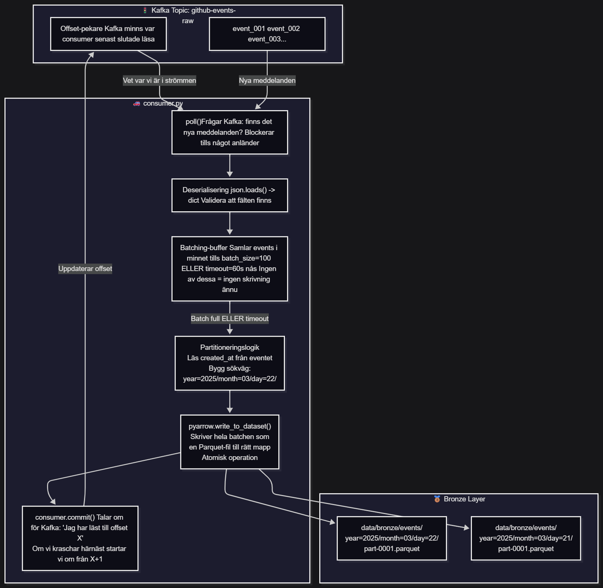

# Own docs for producer.py script
Nästa naturliga steg efter producern är consumern. Den som *LYSSNAR* på kafka topicen och skriver alla events till `Bronze` som Parquet. Consumern är den **andra** halvan av ingestion lagret och när den väl är på plats så är `Bronze` klar. Då är bronze pipelinen klar. Från `Github API -> Producer -> Kafka -> Consumer -> Parquet`

## Snabb teoretisk överblick om consumern.
```
Consumern har ett mycket viktigare och ännu mer komplext jobb än producern. Producern är s.k 'stateless'. Den bryr sig inte om vad som hände tidigare poll cykler. Consumern däremot måste tänka på: 

- BATCHING, dvs samla ihop events och skriva dom som en Parquet fil istället för att skriva en fil per event.

- Offset hantering, Kafka håller koll på vad consumern redan har läst så att OM den kraschar kan den fortsätta där den slutade.

- Partitionering, Skriva till rätt year=/month=/day/ folder automatiskt baserat på eventets timestamp.
```
**Enkel liknelse vs producer och consumer**
- Producern är dum som tåget. Allt den behöver fokusera på är att hålla tiden för avgång. Konstant avgång var 5e minut.

- Consumern däremot är dock mer komplicerad. Passande liknelse för consumern kan vara en självkörande bil på en motorväg.
    - På motorvägen måste "bilen" alltid hålla koll på trafikflödet(`batching`). Den har en automatisk hastighetshållare som anpassar sig beroende på hastigheten på vägen(`offset handling`) och sen måste den se till att ligga i RÄTT fil för att kunna ta RÄTT avfart på motorvägen för att nå sin destination(`partitionering`)


## Visuell förklaring över consumer flödet av data



```
Det kritiska att lägga märke till i diagrammet är ordningen på de två sista stegen. 
WRITE kommer före COMMIT. Det är inte slumpmässigt. 

Om jag committade offset till Kafka först och sen kraschade innan Parquet-filen hann skrivas till disk skulle jag ha lurat Kafka att tro att jag bearbetat events som aldrig faktiskt sparats. 

De eventen är borta för alltid. Genom att skriva till disk först och sedan bekräfta till Kafka garanterar jag att om något går fel, kör jag om från samma offset och skriver filen igen. Parquet-skrivning är idempotent, att skriva samma data två gånger är ofarligt. Att tappa data är inte det.
Det är samma tanke som låg bakom .upsert() i Glossary DB. Hellre en gång för mycket än en gång för lite.
```